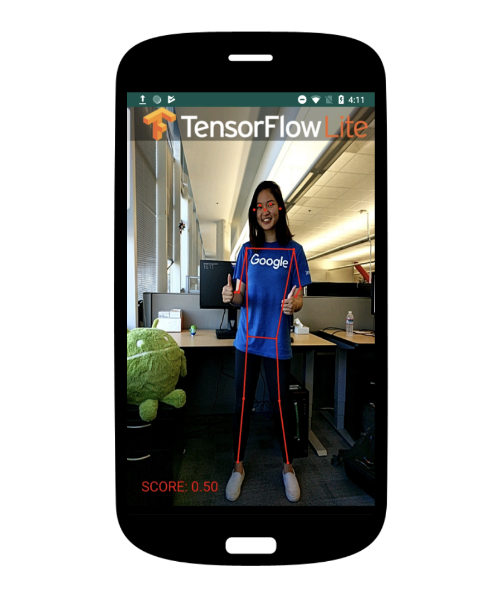

# LiteRT Pose Estimation Android Demo

### Overview
This is an app that continuously detects the body parts in the frames seen by
your device's camera. These instructions walk you through building and running
the demo on an Android device. Camera captures are discarded immediately after
use, nothing is stored or saved.

The app demonstrates how to use 4 models:

* Single pose models: The model can estimate the pose of only one person in the
input image. If the input image contains multiple persons, the detection result
can be largely incorrect.
   * PoseNet
   * MoveNet Lightning
   * MoveNet Thunder
* Multi pose models: The model can estimate pose of multiple persons in the
input image.
   * MoveNet MultiPose: Support up to 6 persons.

See this [blog post](https://blog.tensorflow.org/2021/05/next-generation-pose-detection-with-movenet-and-tensorflowjs.html)
for a comparison between these models.



## Build the demo using Android Studio

### Prerequisites

* Install a recent version of **[Android Studio](
 https://developer.android.com/studio/index.html)** or use the Gradle wrapper
 with JDK 25 and Android SDK 36.

* Android device and Android development environment with minimum API 23.

### Building
* Open Android Studio, and from the `Welcome` screen, select
`Open an existing Android Studio project`.

* From the `Open File or Project` window that appears, navigate to and select
 the `lite/examples/pose_estimation/android` directory from wherever you
 cloned the `tensorflow/examples` GitHub repo. Click `OK`.

* If it asks you to do a `Gradle Sync`, click `OK`.

* You may also need to install various platforms and tools, if you get errors
 like `Failed to find target with hash string 'android-21'` and similar. Click
 the `Run` button (the green arrow) or select `Run` > `Run 'android'` from the
 top menu. You may need to rebuild the project using `Build` > `Rebuild Project`.

* If it asks you to use `Instant Run`, click `Proceed Without Instant Run`.

* Also, you need to have an Android device plugged in with developer options
 enabled at this point. See **[here](
 https://developer.android.com/studio/run/device)** for more details
 on setting up developer devices.

You can also build the debug APK from the command line:

```shell
./gradlew --offline clean :app:assembleDebug
```

The offline flag requires the container or workstation to already contain the
Gradle distribution, JDK, Android SDK, plugins, and Maven dependencies.


### Model used
All models required by the application are versioned in
`app/src/main/assets`. The `verifyModelAssets` task runs before every build and
checks their SHA-256 digests. Building the application never downloads models
or writes generated files into the source tree.

If you explicitly want to download the model, you can download it from here:

* [Posenet](https://storage.googleapis.com/download.tensorflow.org/models/tflite/posenet_mobilenet_v1_100_257x257_multi_kpt_stripped.tflite)
* [Movenet Lightning](https://kaggle.com/models/google/movenet/frameworks/tfLite/variations/singlepose-lightning)
* [Movenet Thunder](https://www.kaggle.com/models/google/movenet/frameworks/tfLite/variations/singlepose-thunder)
* [Movenet MultiPose](https://www.kaggle.com/models/google/movenet/frameworks/tfLite/variations/multipose-lightning-tflite-float16)

### Additional Note
_Do not delete the assets folder content._ If an asset is removed or corrupted,
restore it from version control; the build will fail with a verification error.
